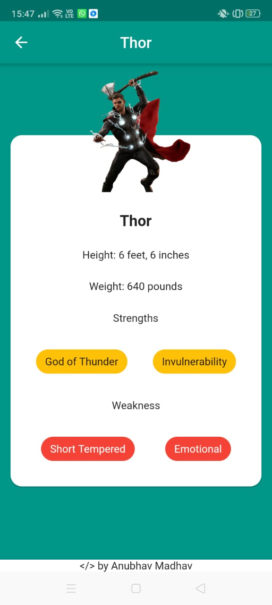

# Avengers App
---
This application is developed using Flutter SDK and uses Dart Programming Language.
---

---
>Home Page:
---

---
> Avenger Details (Example 1)
---

---
> Avenger Details (Example 2)
---

---

## This Application fetches data from a JSON API developed by me, feel free to use this JSON API in your projects, it'll be good if you give me some credits for that.
Link to JSON API Repository: [Avengers JSON API](https://github.com/AnubhavMadhav/Avengers-JSON-API)

Please ⭐ the Repository if you liked it.

Connect with me on LinkedIn: [Anubhav Madhav](https://www.linkedin.com/in/anubhav-madhav/)

### Thank You!

